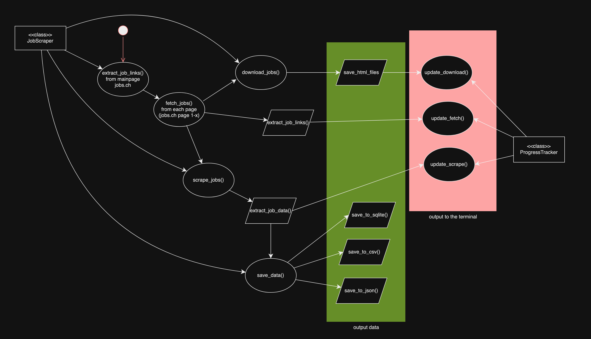

# Job Scraper Project

## Overview
This project is designed to **automate job data collection** from job listing websites using **ScrapingBee**. It extracts job titles, locations, workload, and salaries while storing results in **CSV, JSON, and SQLite** formats. Additionally, the scraper **downloads full job descriptions as HTML files** and archives them in a ZIP for offline storage.

The project follows best practices in **data engineering**, **web scraping**, and **structured data storage**, aligning with the methodologies from **Machine Learning Foundations** and **Data Engineering Fundamentals** courses.

## Project Structure
```
job-crawling/   
|-- data/  
|   |-- job_descriptions.csv  # Scraped job data in CSV format  
|   |-- job_descriptions.json # Scraped job data in JSON format  
|   |-- jobs.db               # SQLite database storing job descriptions  
|   |-- html/                 # Folder containing raw HTML job descriptions  
|   |-- job_html_files.zip    # Compressed archive of downloaded job pages  
|   |-- scraper.log           # Log file for debugging  
|
|-- notebooks/  
|   |-- job_scraper_analysis.ipynb  # Jupyter Notebook for analyzing data  
|
|-- src/  
|   |-- config.py             # Configuration file (contains parameters)  
|   |-- data_saver.py         # Saves data to CSV, JSON, and SQLite  
|   |-- downloader.py         # Downloads and stores job pages to HTML files  
|   |-- fetcher.py            # Fetches job postings from target websites  
|   |-- main.py               # Entire scraping workflow  
|   |-- progress_tracker.py   # Logs and tracks scraping progress 
|   |-- scraper.py            # Core scraper logic (extracts job data)  
|
|-- venv/                     # Virtual environment  
|
|-- .env                  # Stores API keys and sensitive credentials  
|-- .gitignore            # Specifies which files should be ignored by Git  
|-- requirements.txt      # Lists required dependencies  
|-- README.md             # Documentation about the project  
|-- README.pdf            # Documentation about the project  
```
<div style="page-break-before: always;"></div>

## Scraping Workflow  
Processes job postings efficiently from extraction to storage.

- **Link Extraction (`fetcher.py`)** - Scrapes job URLs, handling pagination dynamically. Uses a **queue-based system** to prevent duplicates and track progress efficiently. Multi-threading speeds up processing, while error handling retries failed requests.  
- **Data Extraction (`scraper.py`)** - Extracts **Title, Location, Workload, Salary, Contract Type, Date**. Uses a **separate method for job titles** due to HTML structure differences. Salary extraction applies regex to detect numerical ranges and **convert monthly salaries to yearly when needed**. Handles missing values and adapts to site changes.  
- **Storage (`data_saver.py`)** - Saves jobs in **CSV, JSON, SQLite**. Implements **batch writing** to reduce disk operations and improve performance. Prevents duplicates and ensures **data integrity** through validation checks.  
- **HTML Download (`downloader.py`)** - Saves full job descriptions in `/data/html/` and archives them in `job_html_files.zip`. Uses **multi-threading for parallel downloads** and retries failed pages. Ensures job pages are **indexed correctly** for retrieval.  
- **Config (`config.py`)** - Centralized settings for **paths, limits, API Key, anti-detection, and threading**. Configures **multi-threading (`SCRAPER_THREADS`, `FETCHER_THREADS`)** for optimal performance. User-Agent rotation prevents detection, and API keys are securely loaded from `.env`.  
- **Logging (`progress_tracker.py`)** - Logs job progress in `scraper.log`, tracking **processed, skipped, and failed jobs**. Prints real-time updates while keeping logs clean. Uses **`count_lock`** to ensure correct job tracking in multi-threading.  
- **Workflow (`main.py`)** - Orchestrates **fetching, scraping, storing, downloading, tracking**. Uses **a queue system to ensure each job is processed once**. Implements **error handling, retries, and multi-threading**, balancing speed and stability.  


**A preliminary programming workflow was designed to develop the first edition of job_crawling.**



<div style="page-break-before: always;"></div>

## Challenges & Solutions  

- **Pagination & Link Extraction** - `jobs.ch` limits job listings per page, requiring multiple requests. The scraper **detects additional pages dynamically** and fetches them **recursively**, ensuring all jobs are collected without needing hardcoded page limits.  

- **Duplicate Job Storage** - Some job postings **appear multiple times** across different searches, and multithreading caused duplicate processing. A **unique ID system (job ID + title)** filters jobs before storage, ensuring each job is stored only once.  

- **Efficient HTML Downloads** - Storing **100+ raw HTML files** increased storage needs. The scraper **compresses pages into `job_html_files.zip`**, reducing file size and improving retrieval speed. Multi-threading allows **parallel downloads**, and failed requests are **retried up to three times**.  

- **Safe Multithreading (`count_lock`)** - Unsynchronized threads caused **race conditions**, leading to incorrect job counts. Using `threading.Lock()`, job processing is now **atomic**, ensuring only **one thread updates shared counters at a time**, preventing missed or double counts.  

- **Job Queues for Processing** - Without a structured queue, **some jobs were processed multiple times, while others were skipped**. A **FIFO queue system** ensures jobs are processed **in order**, allowing multiple worker threads to handle jobs **without conflicts** while preventing duplicate execution.  

- **Progress Tracking & Logging** - Real-time updates cluttered the terminal, and debugging failed jobs was difficult. Now, **logs track processed, skipped, and failed jobs**, while real-time terminal updates provide user-friendly feedback. Log files include timestamps for **debugging failed requests** without disrupting execution.  

- **Scraping Job Titles Differently** - Job titles have a unique **HTML structure**, causing issues when using the same extraction method for all data. A **separate scraping method** ensures correct extraction by processing **titles first**, followed by the remaining job details, improving accuracy and robustness.  


<div style="page-break-before: always;"></div>

## How to Run the Scraper  

1. **Clone the repository:** `git clone https://gitlab.ti.bfh.ch/franc1/job-crawling.git`  
2. **Install dependencies:** `pip install -r requirements.txt`  
3. **Adjust settings** in `config.py` (HTML limit, job count). -> 2000 scrapes 100 downloads take 12min.
4. **Run the scraper:** `python src/job_scraper.py`  
5. **Analyze data in Jupyter Notebook:** `jupyter notebook job_analysis.ipynb`  


## Final Notes  
This project was developed for **Data Engineering Project & Training 2 - Slot 1**, applying best practices in **web scraping, data transformation, and analysis**. It integrates concepts from **Machine Learning Foundations, Data Engineering Fundamentals, and Python courses**.  

The scraper is optimized with **multithreading, job queues, and progress tracking**, ensuring efficient data handling while preventing duplicates and optimizing downloads.   

## References  

### Documentation & Libraries  
- [Python Official Docs](https://docs.python.org/3/)  
- [ScrapingBee API Docs](https://www.scrapingbee.com/documentation/)  
- [Python `threading` (Multithreading Guide)](https://docs.python.org/3/library/threading.html)  
- [Python `Queue` (Thread-Safe Job Management)](https://docs.python.org/3/library/queue.html)  
- [Python `threading.Lock()`](https://docs.python.org/3/library/threading.html#threading.Lock)  

### AI Assistance  
Some code components were AI-assisted due to time constraints, including:  
- **Multithreading & Job Queues** (`threading.Lock()`, `Queue` management)  
- **Exception Handling & Debugging** (network failures, retries)  
- **File Compression & Storage** (`zip_html_files()`)  
- **Data Storage & Processing** (`save_to_sqlite()`, `save_to_json()`, `save_to_csv()`)  

All AI-generated code was **significantly modified** to fit the project’s structure without disrupting prior work.  

---

For questions or contributions, submit issues or merge requests on **GitLab**.  

**Author:** _[Cyril Franzini, franc1@bfh.ch]_  
**GitLab Repository:** _[https://gitlab.ti.bfh.ch/franc1/job-crawling.git]_  
